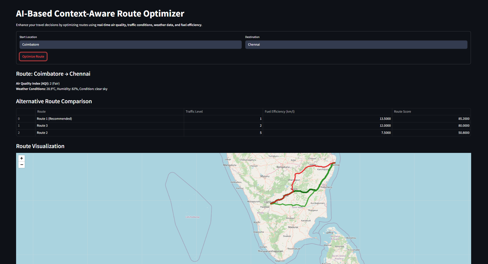
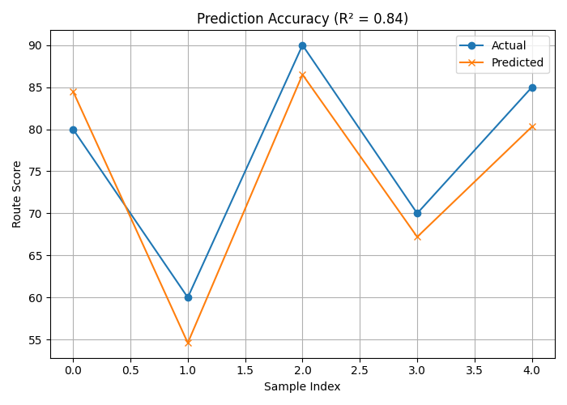
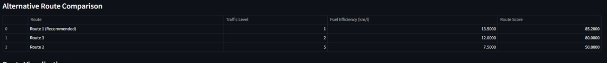

# AI-Based Context-Aware Route Optimization

This project is an intelligent, AI-driven web application that determines the most optimal route between two geographical points. It incorporates **real-time traffic data**, **Air Quality Index (AQI)**, and **fuel efficiency estimations** to deliver a **context-aware route recommendation** system.

Built using a **Random Forest Regressor** model trained on labeled data representing traffic density, pollution levels, and estimated fuel usage, the system predicts a composite **route score** to select the most favorable path for the user.

---

## Project Overview

The application uses data from multiple APIs, applies preprocessing, and scores each possible route option using a trained machine learning model. The best route is highlighted on an interactive map, with all alternatives ranked in a table view.



---

## Features

- Real-time data collection from traffic and AQI sources  
- Intelligent fuel efficiency estimation algorithm  
- Predictive route scoring using a trained AI model  
- Interactive web interface using Streamlit and Folium  
- Ranks and highlights the most optimal route  

---

## Machine Learning Model

A **Random Forest Regressor** was trained to evaluate and score routes based on:

- **Traffic Congestion Level**
- **Air Quality Index (AQI)**
- **Fuel Efficiency Estimation**

The final output is a normalized **route score**, where a higher score indicates a better route considering all factors.

### Model Accuracy

The model was trained on a curated dataset and evaluated using standard regression metrics.



#### Evaluation Metrics Used:

- **Mean Absolute Error (MAE)**
- **Root Mean Squared Error (RMSE)**
- **R² Score**

Model export: `joblib` used to serialize the trained model (`route_score_model.pkl`)

---

## APIs and Data Sources

- **Google Maps API** – for alternative routes, real-time traffic data  
- **OpenWeatherMap Air Pollution API** – for retrieving AQI by coordinates  
- **Custom Fuel Estimation Function** – based on route distance, traffic intensity, and estimated vehicle parameters  

---

## Installation

### Prerequisites

- Python 3.8+
- Google Maps API key
- OpenWeatherMap API key

### Setup Instructions

1. **Clone the repository:**

```bash
git clone https://github.com/your-username/route-optimizer.git
cd route-optimizer
```

2. **Install dependencies:**

```bash
pip install -r requirements.txt
```

3. **Add your API keys:**

Create a `.env` file and insert:

```ini
GOOGLE_MAPS_API_KEY=your_key_here
AQI_API_KEY=your_key_here
```

4. **Run the app:**

```bash
streamlit run app.py
```

---

## Project Structure

```bash
route-optimizer/
├── app.py                  # Streamlit interface
├── train_model.py          # ML model training script
├── utils.py                # Helper functions (API calls, scoring, fuel est.)
├── route_score_model.pkl   # Trained Random Forest model
├── requirements.txt        # Project dependencies
├── .env                    # API keys (not committed)
└── screenshots/
    ├── output.png
    ├── model_accuracy.png
    └── table.png
```

---

## How the System Works

### 1. User Input
Start and destination locations are entered by the user.

### 2. Route Retrieval
Google Maps API fetches multiple alternative routes between the points.

### 3. Data Enrichment
- Traffic levels for each route  
- AQI data from OpenWeatherMap for each region  
- Estimated fuel consumption for each route  

### 4. AI-Based Scoring
Each route is passed to the Random Forest Regressor, which outputs a score.

### 5. Visualization
- All routes are displayed on a map.  
- Ranked scores are presented in a table view.

---

## Table View of Ranked Routes




---

## Technologies Used

- **Frontend:** Streamlit, Folium, HTML/CSS  
- **Backend:** Python, Scikit-learn, Joblib  
- **Visualization:** Folium (Map), Streamlit Tables  
- **Machine Learning:** Random Forest Regressor (scikit-learn)  
- **APIs:** Google Maps API, OpenWeatherMap AQI API  

---

## Future Enhancements

- Integration with public transport data  
- Multi-modal route recommendation (car, bike, public)  
- User profiling for personalized route recommendations  
- Reinforcement learning-based route evaluation  

---

## Author

**Chris Joseph George**  
📧 Email: [chrisjosephgeorge@gmail.com]  
🔗 LinkedIn: [[your-linkedin-url](https://www.linkedin.com/in/chris-joseph-george/)]
